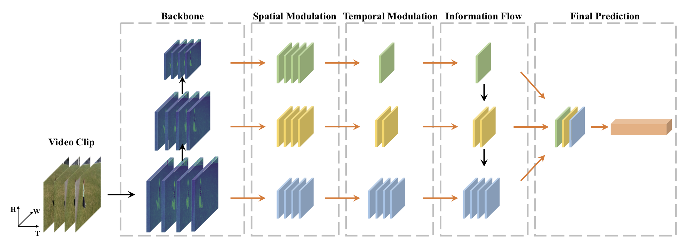

# Temporal Pyramid Network for Action Recognition 


[[Paper](https://arxiv.org/pdf/2004.03548.pdf)]


- `configs`: 各模型配置文件模板
- `metrics`: Youtube-8，Kinetics数据集评估脚本，以及模型自定义评估方法
- `train.py`: 一键式训练脚本，可通过指定模型名，配置文件等一键式启动训练
- `eval.py`: 一键式评估脚本，可通过指定模型名，配置文件，模型权重等一键式启动评估
- `predict.py`: 一键式推断脚本，可通过指定模型名，配置文件，模型权重，待推断文件列表等一键式启动推断


## Get Started
Please refer to [GETTING_STARTED](./tools/README.md) for detailed usage.

## Quick Demo
We provide `test_video.py` to inference a single video.

```
python ./test_video.py 
```

video dir at './data/dataset/inferlist.txt'

the log will show the infer result,the infer.json also will be save at './data/predict_results/infer.json'

For example, we can predict for the demo video (download [here](https://drive.google.com/open?id=14VYS8hGA5i1J70qBqrUqLiDxJq_FgXiW) and put it under `demo/.`)  by running:


## train

    python train.py  
    
    python multi_gpus_train.py
    
At Aistudio script task:
    
    deliver main.py 
    
Detail:

    python train.py --model_name=TPN \
                        --config=./configs/tpn.yaml \
                        --log_interval=10 \
                        --valid_interval=1 \
                        --use_gpu=True \
                        --save_dir=./data/checkpoints \
                        --fix_random_seed=False \
                        --pretrain=$PATH_TO_PRETRAIN_MODEL
                        
                        
## eval
    python eval.py 
                    
                    
eval file is './data/dataset/vallist.txt'

the log will show the eval result, the eval.json also will be save at './data/evaluate_results/eval.json'

测试时数据预处理的方式跟训练时不一样，crop区域的大小为256x256，不同于训练时的224x224，所以需要将训练中预测输出时使用的全连接操作改为1x1x1的卷积。每个视频抽取图像帧数据的时候，会选取10个不同的位置作为时间起始点，做crop的时候会选取三个不同的空间起始点。在每个视频上会进行10x3次采样，将这30个样本的预测结果进行求和，选取概率最大的类别作为最终的预测结果。

原文中是每个视频采样长度是32x2
单卡上做了一次验证采用的是8x8的方式，所以精度比原文低了很多

由于单卡资源受限，cpu解码限制了速度（多卡脚本环境问题导致eval程序跑不起来），尝试采用32x2程序跑一半内存溢出，给我退出了...
后来调试好后在脚本任务上测试得出了与原文相同的结果
结果都保存在'./data/evaluate_results/'下


